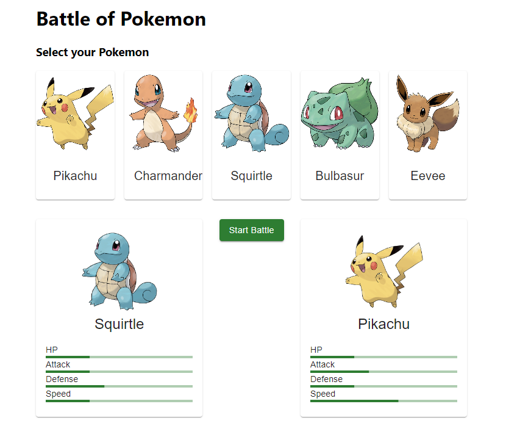

# Pokémon Battle

This project simulates battles between Pokémon using a backend built with NestJS, a frontend built with React and Material-UI, and a SQLite database.


## Screenshot




## Installation

Clone the Repository

```bash
  git clone https://github.com/jsepic89/test-phinx
  cd server
  npm install
  cd..
  cd client
  npm install 
```


## Run Migration

First compile the project, to make sure the migration is available in .js format:

```bash
  npm run build
```

Now run the migration:

```bash
  npm run migration:run
```
## Run Project

Start the server. 

```bash
  cd server
  npm run start
```

The server will start and listen on the configured port (default is http://localhost:3000).

Start the client

```bash
  cd client
  npm start
```

The frontend will start and open in port 5000 as configured in package.json.


## Usage

  1.  Open your web browser and navigate to http://localhost:5000.
  2.  Select a Pokémon to start a battle.
  3.  The opponent will be randomly selected.
  4.  Click "Start Battle" to see the results.
## Technologies used

- Backend: NestJS
- Frontend: React, Material-UI 
- Database: SQLite